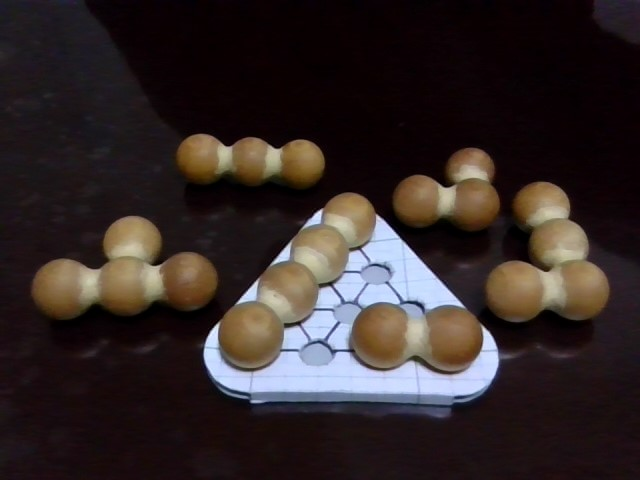
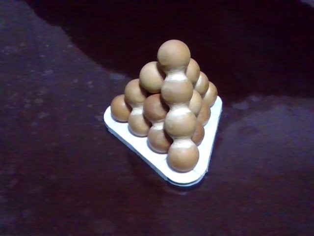
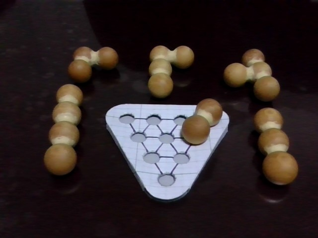
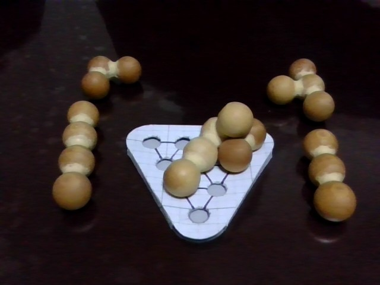
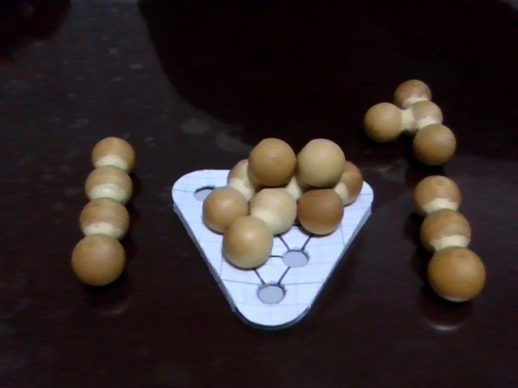
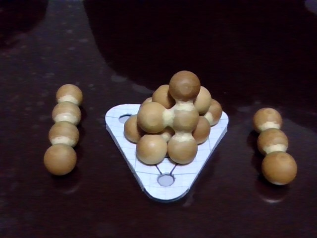
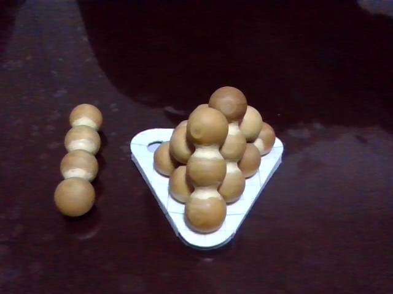
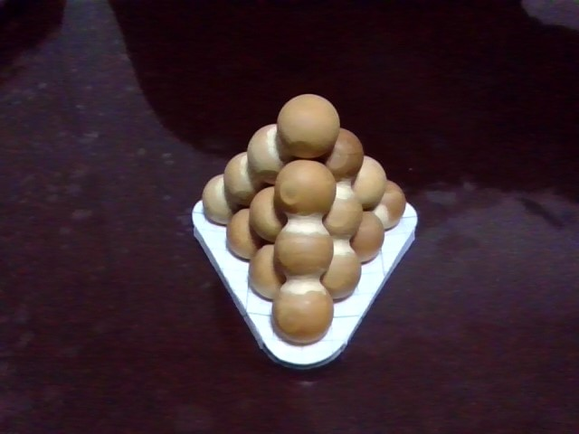

# Twenty-Ball Pyramid Puzzle

## The problem

Suppose we have twenty balls of equal size and stack them up to make a pyramid.
The "pyramid" here is actually a regular tetrahedron; its base is an equilateral triangle
composed of ten balls closely packed together such that their centers form a triangular lattice:

```
          0
         / \                    10
        /   \                    o
       1-----2                  / \              16
      / \   / \                /   \              o
     /   \ /   \           11 o-----o 12         / \        19
    3-----4-----5            / \   / \          /   \        o
   / \   / \   / \          /   \ /   \        o-----o
  /   \ /   \ /   \        o-----o-----o      17    18
 6-----7-----8-----9      13    14    15

        0-th                    1st              2nd        3rd
       (Base)                                              (Top)
```

The upper, first to third (top), layers are again triangular lattice layers,
composed of six, three, and one ball(s), respectively.

Now the problem we want to solve is _how to make the pyramid
if the balls were glued together with right angles
into six [polyomino](https://en.wikipedia.org/wiki/Polyomino)-like pieces as follows:_

```
                    o
                    |
 o                  o                 o
 |                  |                 |
 o      o--o--o     o       o         o        o
 |         |        |       |         |        |
 o--o      o        o       o--o      o        o

 'L'      'T'      'I'      'v'      'i'      'd'
```

And, if it is possible to make the pyramid (in fact it is),
we also want to know _how many unique ways there are to make the pyramid_.

<details>

<summary>
See some pictures of the six pieces made of wooden balls and
the pyramid assembled from those pieces.
</summary>





</details>

## How to solve it

At first, it might seem impossible to make a triangular pyramid from right-angled pieces.
To see why it is possible, notice that the pyramid is part of the close sphere packing
called the _face-centered cubic_ or FCC.

> To find the _unit cube_ in the pyramid, place three more balls in the second layer
> so that each of them touches two of the three existing balls.
> Then the ball numbered 4 in the base and the balls in the above layers form the unit cube;
> the six balls numbered 11, 12, 14, 16, 17, and 18 lie at the centers of its faces and
> the other eight balls at its vertices, hence the name FCC.
> See also: https://mathworld.wolfram.com/CubicClosePacking.html

The FCC arrangement can also be obtained by stacking, as closely as possible, layers of spheres
such that their centers form a square lattice (instead of a triangular lattice).
We can find such square lattice layers in the pyramid by sectioning it with planes parallel to
a pair of the opposite edges, say, 0-1-3-6 and 9-15-18-19:

```
 0 o
   |     2 o--o 10     5 12 16
 1 o       |  |        o--o--o     9 15 18 19
   |     4 o--o 11     |  |  |     o--o--o--o
 3 o       |  |        o--o--o
   |     7 o--o 13     8 14 17
 6 o
```

Similarly, we can find two more sets of parallel square lattice layers in the pyramid, i.e.,
a set of square lattice layers parallel to 6-7-8-9 and 0-10-16-19:

```
 6 o
   |     3 o--o 13     1 11 17
 7 o       |  |        o--o--o     0 10 16 19
   |     4 o--o 14     |  |  |     o--o--o--o
 8 o       |  |        o--o--o
   |     5 o--o 15     2 12 18
 9 o
```

and a set of square lattice layers parallel to 0-2-5-9 and 6-13-17-19:

```
 0 o
   |     1 o--o 10     3 11 16 
 2 o       |  |        o--o--o     6 13 17 19
   |     4 o--o 12     |  |  |     o--o--o--o
 5 o       |  |        o--o--o
   |     8 o--o 15     7 14 18
 9 o
```

Now that we have got those square lattice layers in which we can place the polyomino-like pieces,
it is not particularly difficult to solve the puzzle by hand.
Rather than explaining how to solve it in words,
I have written a [computer program](./puzzle.cpp) solving it that I hope is self-explanatory.

My solver program will print all the solutions (possible configurations that are unique)
formatted as a pyramid.
For instance, the first one found is given by

```
         (i)
         / \
        /   \                   (i)
      (T)---(L)                 / \
      / \   / \                /   \             (i)
     /   \ /   \             (T)---(T)           / \
   (d)---(L)---(v)           / \   / \          /   \       (I)
   / \   / \   / \          /   \ /   \       (T)---(I)
  /   \ /   \ /   \       (L)---(v)---(I)
(d)---(L)---(v)---(I)
```

where I have fixed the orientation of an asymmetric piece denoted by `L` and
tried to place it only in the first set of the parallel square lattice layers
(i.e., those parallel to 0-1-3-6 and 9-15-18-19)
so that configurations thus obtained are unique up to rotation and reflection.

Since the two straight pieces `I` and `i` form two adjacent edges of the pyramid
(sharing the top ball),
it is trivial to obtain another solution by exchanging those two pieces.
It is going to turn out however that there is no more solution.

<details>

<summary>
See how to assemble the pyramid shown above step by step.
</summary>

1. Place `d` in a corner of the base.
   (Note that the base is rotated by 180 degrees compared to the above diagram;
   when taking the picture with a webcam, I was sitting on the opposite side.)

   

2. Place `L` so as to lean on `d`.

   

3. Place `v` so as to lean on `L` but not to touch `d`.

   

4. Place `T` so as to lean on all the pieces placed so far.

   

5. Place `i` so as to lean on `L` and `T`.

   

6. Place `I` where it fits!

   

</details>

## Note on references

I first came across this puzzle in a column of a now discontinued Japanese programming magazine
entitled _C MAGAZINE_.
The column that introduced the puzzle was published around 2000;
unfortunately, I no longer have access to it and cannot give a precise citation on it.
Although I, to be honest, was not able to solve the puzzle at first,
I was so fascinated by it that I created my own (some pictures of which are shown above)
and have kept it to this day.
In the column, the author said, if I remember correctly, that
they had bought a copy of the puzzle in the US.
Some years ago, I happened to find the same puzzle dubbed
["perplexing pyramid"](http://www.robspuzzlepage.com/assembly.htm#gordonsolns)
at a web museum of mechanical puzzles entitled
[Rob's Puzzle Page](http://www.robspuzzlepage.com/).
I believe the author of the column I enjoyed must have been happy to buy
the puzzle with this nicely alliterated name.
